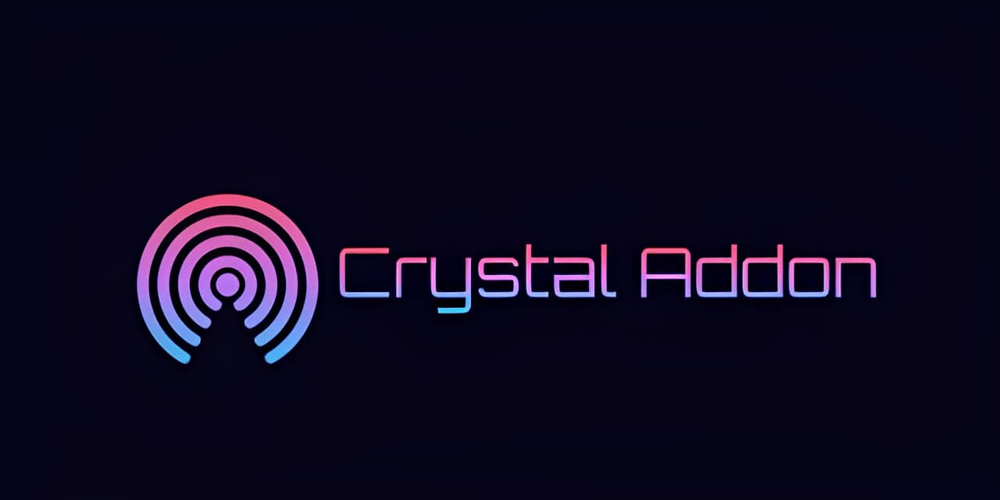

# Crystal Addon




[](https://github.com/GriefUnion/Crystal-Addon-Reborn)

Crystal Addon is a Minecraft addon designed for Meteor Client, compatible with the latest version of minecraft. It is intended for exploring and identifying exploits, as well as learning about their usage.

# How-to

## Build:

1. Open your terminal or command prompt in the directory for Crystal Addon.
2. Run the following commands in order:
    ```shell
    ./gradlew clean
    ./gradlew genSources
    ./gradlew build
    ```

## FAQ:

* What Meteor version is the mod for?
    * The latest meteor snapshot. Likely to work for older ones.
* Why does the game crash when I run the .dupereal command?
    * It's intended as a joke command.
* What Minecraft version is this for?
    * We target the latest version of minecraft but always try to support older versions if no big changes were made.
* Why do I get issues while building?
    * Feel free to make an issue report either in our discord server or on the GitHub issues tab.

# Support

We are here to provide you with the best support possible. If you have any questions, concerns, or need assistance, feel free to reach out to us through the following channels:

* Discord [https://discord.gg/7Fu9PVFgKS](https://discord.gg/7Fu9PVFgKS)

# Credits

## Development

* Original Developer: SpecKeef (XSS6)

* Founder: 9x00

* [GriefUnion](https://github.com/GriefUnion) Rewriting & re-continuing the addon, also for most of the modules that were in the original crystal addon.

# Info

## Versions

* Latest
    * [Download](https://github.com/GriefUnion/Crystal-Addon-Reborn/releases/latest)

# Legal

[LICENSE](https://github.com/GriefUnion/Crystal-Addon-Reborn/blob/master/LICENSE)

* Modules like UDP Flood are only for pen-testing and educational purposes. I strongly discourage any malicious use of them.
